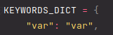
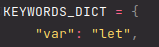
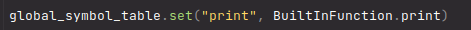
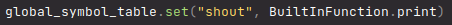
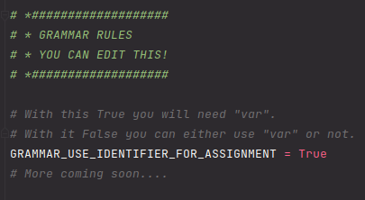
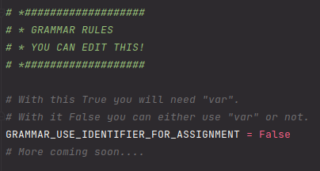

# What is whython?
> An almost fully customizable language made in python!

Whython is a project language, the idea of it is that anyone can download
and edit the language to make it suitable to what they want. This could be
a change that makes it more like a language they know; a change that makes
it easier for new people to learn the language; or even a change that makes
it into a shitpost, it doesn't matter. You have the control!

# How to run
1. Download [whython](whython)
2. Run [shell.py](whython/shell.py)
3. Have fun!

# What can whython do?
At the point of writing this (the first main push) you can change anything in the 
file [editable.py](whython/editable_/editable.py). This means you can change all the 
keywords (except = - / * ^) and all the builtin function names. 
### Keywords
For example, you may not like creating a variable like this:
```
var x = 10
```
and so you can change `KEYWORDS_DICT["var"]` to "let" and create a variable like this:
```
let x = 10
```

<br>to<br>


If you want to be super quirky you can even use emojis in the `KEYWORDS_DICT` and make
some horrible emoji language!
### Builtin functions
You may hate calling print like this:
```
print("Hello, World!")
```
and so you can change the global_symbol_table to be "shout" and print like this:
```
shout("Hello, World!")
```

<br>to<br>


### Syntax
Sometimes it can be annoying typing out:
``` 
var x = 10
```
so you may want this:
``` 
x = 10
```
To do this change:<br>

<br>to<br>


# What are the plans?
I am planning to allow more control, for example a way to change all grammar rules 
and also easily add builtins (right now its kind of tedious).

# How can I contribute?
Either create a request on GitHub or message me on discord `Nexin#0001` to ask for
new features.

# Background
This project was meant to be something small to learn about how languages run, but 
now it's a little more than that. I was originally following `codepulse`'s 
tutorial on YouTube but have since change a lot of the grammar rules and made 
it easier to debug. 
